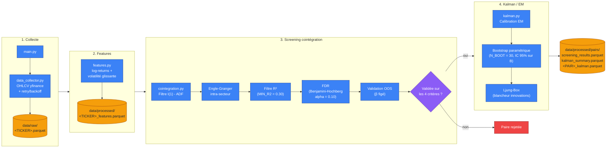

# QuantPipe

Pipeline de données financières dockerisé pour l'analyse quantitative.

Collecte des données OHLCV (Yahoo Finance) → feature engineering (log-returns, volatilité) → screening de paires cointégrées (Engle-Granger + FDR + validation OOS) → calibration Kalman/EM sur les spreads — le tout reproductible via Docker.

## Flux du pipeline



## Architecture

```
QUANT_PIPE/
├── main.py                  # Orchestrateur du pipeline (point d'entrée, appelé par Docker)
├── DATA_RET/
│   ├── data_collector.py    # Collecte OHLCV (yfinance) + retry/backoff + logging
│   ├── features.py          # Feature engineering pur (log-returns, volatilité, corrélations)
│   ├── cointegration.py     # Screening Engle-Granger + FDR + validation OOS (fonctions pures)
│   ├── kalman.py             # Filtre de Kalman + lisseur RTS + EM + bootstrap paramétrique
│   └── pairs_pipeline.py    # Orchestrateur du module paires cointégrées
├── data/
│   ├── raw/                 # Données brutes, jamais transformées (non versionné)
│   └── processed/           # Features + résultats de screening/Kalman (non versionné)
│       └── pairs/           # screening_results.parquet, kalman_summary.parquet, <PAIR>_kalman.parquet
├── Dockerfile
├── docker-compose.yml
├── requirements.txt
├── .gitignore
└── .dockerignore
```

**Principe de séparation raw / processed** : `data/raw/` ne contient que ce qui sort tel quel de Yahoo Finance, sans aucune transformation. `data/processed/` contient uniquement les features et résultats dérivés (log-returns, volatilité, screening, Kalman). On ne mélange jamais les deux — convention standard en data engineering qui permet de recalculer tout ce qui est dérivé à tout moment sans re-télécharger les données.

**Pourquoi `main.py` est à la racine et pas dans `DATA_RET/`** : c'est le point d'entrée Docker (`WORKDIR /app` + `COPY . .` + `CMD ["python", "main.py"]`). Il ajoute `DATA_RET/` à `sys.path` au démarrage pour pouvoir importer les modules qui y vivent, indépendamment du répertoire courant depuis lequel il est lancé.

## Concepts clés implémentés

- **Stationnarité** : un prix brut n'est pas stationnaire (tendance + variance changeante) ; on le transforme en log-prix/log-returns pour l'analyse. Vérifié empiriquement via le test ADF (`is_integrated_order1` dans `cointegration.py`).
- **Log-returns vs rendements simples** : `r_log = ln(P_t / P_t-1)`, additifs dans le temps (utile pour l'agrégation) et symétriques (contrairement aux rendements simples).
- **Cointégration (Engle-Granger)** : deux séries I(1) individuellement non-stationnaires peuvent avoir une combinaison linéaire stationnaire — condition théorique du pairs trading. Screening intra-secteur uniquement (pas cross-sector, pour limiter le nombre de tests sans justification économique).
- **Correction FDR (Benjamini-Hochberg)** : contrôle le taux de fausses découvertes sur les tests multiples du screening, moins conservateur que Bonferroni, adapté à un screening exploratoire.
- **Validation hors échantillon (OOS)** : le spread est reconstruit sur les données de test avec le β figé (jamais ré-estimé) et retesté pour stationnarité — une cointégration in-sample qui ne survit pas à ce test est un artefact de surajustement, pas un signal exploitable.
- **Modèle Kalman/EM** : le spread cointégré est modélisé comme un processus local-level `x_t = A + B·x_{t-1} + ε_t`, `y_t = x_t + η_t`, calibré par EM, avec intervalle de confiance sur `B` obtenu par bootstrap paramétrique et diagnostic de blancheur des innovations (test de Ljung-Box).

## Mathématiques du pipeline

### Log-returns

$$r_t = \ln\left(\frac{P_t}{P_{t-1}}\right)$$

Contrairement au rendement simple $\frac{P_t - P_{t-1}}{P_{t-1}}$, le log-return est additif dans le temps ($r_{t_1 \to t_3} = r_{t_1 \to t_2} + r_{t_2 \to t_3}$) et symétrique (une hausse de 50% suivie d'une baisse de 50% ne ramène pas au prix initial en rendement simple, mais les log-returns correspondants s'annulent bien en valeur absolue).

### Stationnarité — test ADF

Le test de Dickey-Fuller augmenté teste l'hypothèse nulle de racine unitaire sur une série $x_t$ :

$$\Delta x_t = \alpha + \beta t + \gamma x_{t-1} + \sum_{i=1}^{p} \delta_i \Delta x_{t-i} + \varepsilon_t$$

$H_0 : \gamma = 0$ (racine unitaire, série non-stationnaire / intégrée d'ordre ≥ 1) contre $H_1 : \gamma < 0$ (série stationnaire). Une série de prix I(1) doit être différenciée une fois (log-returns) pour devenir stationnaire I(0).

### Cointégration — Engle-Granger

Pour deux séries $y_t$ et $x_t$ individuellement I(1), on estime la régression statique :

$$y_t = \beta_0 + \beta_1 x_t + u_t$$

par MCO, puis on applique le test ADF sur les résidus $\hat{u}_t$. Si $\hat{u}_t$ est stationnaire (rejet de la racine unitaire, avec des valeurs critiques spécifiques à Engle-Granger, plus strictes que l'ADF standard), $y_t$ et $x_t$ sont cointégrées : il existe une combinaison linéaire stationnaire malgré la non-stationnarité individuelle des deux séries. C'est $\hat{u}_t = y_t - \beta_0 - \beta_1 x_t$ qui constitue le spread trading.

### Correction FDR — Benjamini-Hochberg

Sur $m$ tests (une $p$-value $p_{(i)}$ par paire candidate), triés par ordre croissant, on cherche le plus grand $k$ tel que :

$$p_{(k)} \le \frac{k}{m} \cdot \alpha$$

et on rejette $H_0$ (i.e. on retient la paire comme cointégrée) pour tous les tests $i \le k$. Contrôle le taux de fausses découvertes attendu à $\alpha$ (ici 0.10) plutôt que le risque global d'au moins une fausse découverte (Bonferroni), donc moins conservateur — adapté à un screening exploratoire sur de nombreuses paires.

### Validation OOS

Le $\beta_1$ estimé en in-sample est figé, et le spread OOS est reconstruit par simple substitution :

$$\hat{u}_t^{OOS} = y_t^{OOS} - \beta_0 - \beta_1 x_t^{OOS}, \quad t \in \text{test}$$

Un nouveau test ADF est appliqué sur $\hat{u}_t^{OOS}$. Comme $\beta_1$ n'est jamais ré-estimé sur les données de test, une stationnarité qui ne survit pas ici est un artefact de surajustement in-sample, pas une relation économique réelle.

### Modèle Kalman / EM

Le spread cointégré est modélisé comme un processus local-level (state-space linéaire-gaussien) :

$$x_t = A + B\,x_{t-1} + \varepsilon_t, \qquad \varepsilon_t \sim \mathcal{N}(0, Q)$$
$$y_t = x_t + \eta_t, \qquad \eta_t \sim \mathcal{N}(0, R)$$

où $x_t$ est l'état latent (niveau du spread) et $y_t$ l'observation bruitée. Le filtre de Kalman produit l'estimée filtrée $\hat{x}_{t\mid t}$ récursivement (étapes prédiction / mise à jour), et le lisseur RTS (Rauch-Tung-Striebel) raffine cette estimée en incorporant l'information future ($\hat{x}_{t\mid T}$).

Les paramètres $(A, B, Q, R)$ sont inconnus et estimés par l'algorithme EM (Expectation-Maximization) :
- **E-step** : calcul des espérances des états latents via le lisseur, sachant les paramètres courants.
- **M-step** : ré-estimation de $(A, B, Q, R)$ par maximum de vraisemblance, sachant les états lissés.
- Itération jusqu'à convergence de la log-vraisemblance.

L'incertitude sur $B$ (persistance du spread, liée à la vitesse de retour à la moyenne) est quantifiée par bootstrap paramétrique : simulation de $N\_BOOT$ trajectoires sous le modèle estimé, ré-estimation EM sur chacune, IC 95% empirique sur la distribution des $\hat{B}$ obtenus.

Enfin, le test de Ljung-Box est appliqué aux résidus d'innovation du filtre pour vérifier leur blancheur :

$$Q_{LB} = n(n+2) \sum_{k=1}^{h} \frac{\hat{\rho}_k^2}{n-k} \sim \chi^2_h \text{ sous } H_0 \text{ (bruit blanc)}$$

Le rejet de $H_0$ indique une mauvaise spécification du modèle (autocorrélation résiduelle non capturée).

## Installation locale (sans Docker)

```bash
git clone https://github.com/hamzaahrim0/QUANT_PIPE.git
cd QUANT_PIPE

python -m venv venv
source venv/bin/activate        # Windows : venv\Scripts\activate

pip install -r requirements.txt

python main.py                  # lance le pipeline complet (features + paires)
```

Pour lancer uniquement le module paires cointégrées (utile en itération) :

```bash
cd DATA_RET
python -c "from pairs_pipeline import run_pairs_pipeline; run_pairs_pipeline(start='2023-01-01', end='2026-01-01')"
```

`start`/`end` filtrent la fenêtre temporelle et servent aussi à télécharger automatiquement, via `data_collector.py`, tout ticker de `SECTOR_UNIVERSE` absent de `data/raw/` — inutile de lancer un script séparé pour peupler l'univers sectoriel au préalable.

## Installation avec Docker (recommandé pour la reproductibilité)

```bash
# Build de l'image
docker build -t quantpipe .

# Lancement via docker-compose (recommandé)
docker compose up --build
```

**Pourquoi un volume est indispensable** : le conteneur est éphémère — tout ce qui est écrit à l'intérieur sans volume disparaît à sa suppression. Le volume `./data:/app/data` (défini dans `docker-compose.yml`) fait persister `data/raw/` et `data/processed/` sur la machine hôte, indépendamment du cycle de vie du conteneur.

Pour vérifier la persistance :
```bash
docker compose up --build
docker compose down
ls data/processed/        # les fichiers .parquet doivent toujours être là
ls data/processed/pairs/  # idem pour les résultats du screening/Kalman
```

## Pipeline — ce qu'il fait

1. **Collecte** (`DATA_RET/data_collector.py`) : télécharge l'historique OHLCV pour une liste de tickers (`AAPL`, `MSFT`, `GOOG`, `AMZN` par défaut, configurable dans `main.py`), avec retry + backoff exponentiel en cas d'échec réseau. Un ticker en échec est ignoré (loggé en warning), le pipeline continue avec les autres.
2. **Sauvegarde brute** : chaque ticker est stocké en Parquet dans `data/raw/<TICKER>.parquet`.
3. **Feature engineering** (`DATA_RET/features.py`) : calcul des log-returns et de la volatilité glissante annualisée (fenêtre de 20 jours) via des fonctions pures (aucun effet de bord).
4. **Sauvegarde des features** : résultat stocké dans `data/processed/<TICKER>_features.parquet`.
5. **Screening de paires cointégrées** (`DATA_RET/pairs_pipeline.py` + `cointegration.py`) : univers sectoriel (`SECTOR_UNIVERSE`, ~40 tickers sur 8 secteurs) → filtre I(1) → test Engle-Granger intra-secteur → filtre R² (`MIN_R2 = 0.30`) → correction FDR (`ALPHA_FDR = 0.10`) → validation OOS avec β figé. Résultat complet dans `data/processed/pairs/screening_results.parquet`.
6. **Calibration Kalman/EM** (`DATA_RET/kalman.py`) : pour chaque paire ayant passé les 4 critères, calibration EM du spread, bootstrap paramétrique (`N_BOOT = 30`, IC 95% sur `B`) et test de blancheur des innovations (Ljung-Box). Résumé dans `data/processed/pairs/kalman_summary.parquet`, état filtré par paire dans `data/processed/pairs/<Y>_<X>_kalman.parquet`.


## Outils

Python · pandas · numpy · yfinance · pyarrow · statsmodels · scipy · Docker · Git
